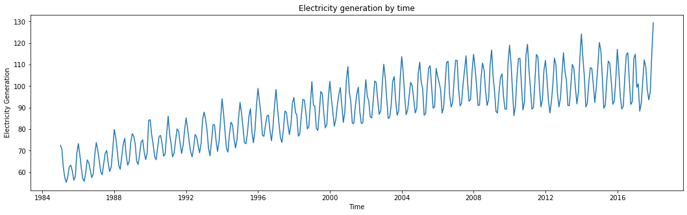
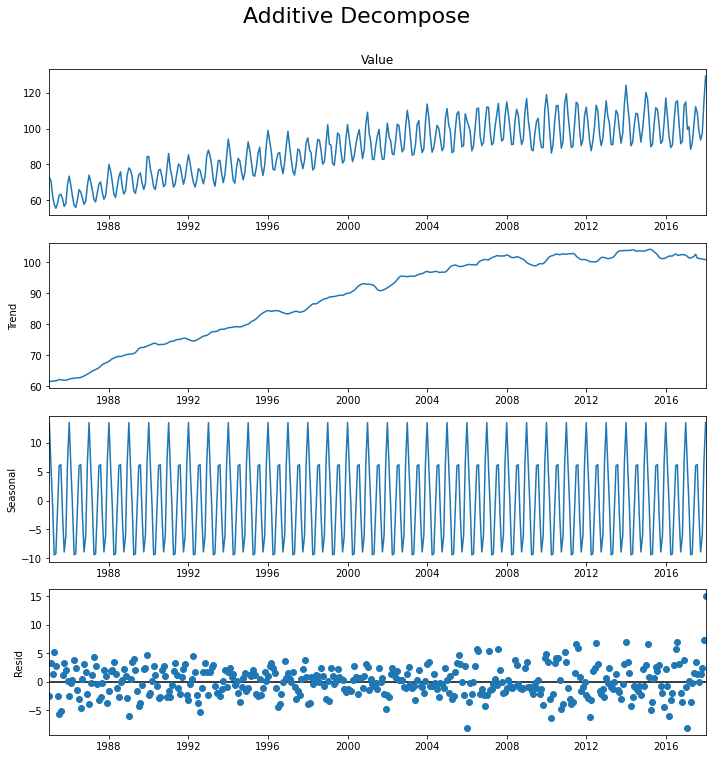
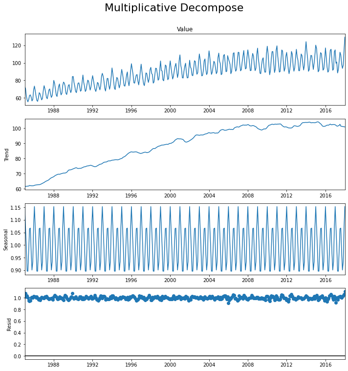
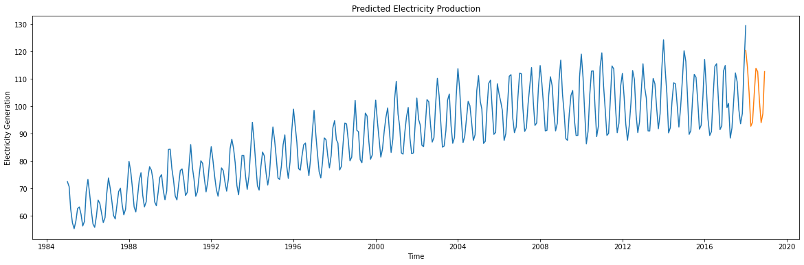

# Electricity Demand Forecasting & Time Series Analysis

!(graphs/powerLines.jpg)

## Introduction

Electricity demand forecasting is critical for utility companies, grid operators, and energy planners to anticipate consumption patterns, optimize resource allocation, and manage financial risk. As global electrification and grid digitalization accelerate, deploying accurate, data-driven forecasting frameworks has become highly vital.

This repository explores time series analysis techniques to understand historic electricity production patterns and forecast future demand. To achieve this, the project is structured into two complementary Jupyter notebooks that transition from descriptive statistical analysis to predictive modeling:

1. **Exploratory Analysis & Decomposition:** [`time-series-electricity-demand.ipynb`](time-series-electricity-demand.ipynb)  
   Focused on intensive Exploratory Data Analysis (EDA), advanced data visualization, stationary testing, and classical time series decomposition techniques.
2. **Predictive Modeling & Forecasting:** [`predict-electricity-consumption.ipynb`](predict-electricity-consumption.ipynb)  
   Focused on building, evaluating, and forecasting future consumption using statistical models including ARIMA and seasonal variants.

Together, these notebooks provide a robust, end-to-end workflow utilizing monthly industrial electricity production index data spanning from 1985 to 2018.

## Solution Overview

- **Programming Language:** Python 3
- **Environment:** Jupyter Notebook
- **Core Library Stack:** - **Data Manipulation:** `Pandas`, `NumPy`
  - **Time Series Statistics:** `Statsmodels` (Seasonal Decompose, ARIMA, SARIMAX)
  - **Data Visualization:** `Matplotlib`, `Seaborn` (using `fivethirtyeight` and clean data presentation styles)
  - **Data Preprocessing:** `Scikit-learn` (`train_test_split`, `preprocessing`), `Dateutil`

---

## Data Pipeline & Exploratory Data Analysis (EDA)

The underlying dataset contains a univariate time series tracking industrial electricity production. The data is structured on a monthly basis, starting from January 1, 1985, through January 1, 2018.

### Data Ingestion & Integrity
The data pipeline implements proper datetime parsing directly during ingestion (`parse_dates=['DATE']`) and validates data integrity by verifying missing values (`df.isnull().sum()`), confirming a clean, continuous baseline sequence with no missing timestamps.

A baseline visualization of the raw electricity generation index reveals critical patterns:

### Key Observations:
- **Upward Trend:** There is a definitive non-linear upward trajectory over the decades, reflecting long-term economic growth and increasing power requirements.
- **Strong Cyclicality:** A highly noticeable, recurring seasonality pattern is present, marked by distinct annual peaks (typically matching peak heating/cooling seasons).

---

## Statistical Time Series Analysis

To translate visual observations into mathematical representations, two distinct methods were deployed across the project files: **Classical Structural Decomposition** and **Parametric Forecasting Models**.

### 1. Seasonal Decomposition
Any time series can be broken down into four foundational components: **Base Level + Trend + Seasonality + Residual Error**. Depending on how the seasonal variations interact with the trend, the series is evaluated using two methodologies:

* **Additive Decomposition:** Implies variations are relatively constant regardless of the current trend value.
    $$\text{Value} = \text{Base Level} + \text{Trend} + \text{Seasonality} + \text{Error}$$
* **Multiplicative Decomposition:** Implies the seasonal amplitude increases or scales proportionally with the trend over time.
    $$\text{Value} = \text{Base Level} \times \text{Trend} \times \text{Seasonality} \times \text{Error}$$

Using `statsmodels.tsa.seasonal.seasonal_decompose`, both configurations were isolated to inspect the precise underlying trend line and strip away noise:

### 2. SARIMAX Forecasting
While Univariate models like ARMA and ARIMA capture auto-regressive properties and trends, they struggle with heavy seasonal cycles. This project implements **SARIMAX** (*Seasonal Auto-Regressive Integrated Moving Average with eXogenous factors*). 

SARIMAX updates standard ARIMA models by adding seasonal parameter configurations $(P, D, Q)_s$, allowing the algorithm to seamlessly learn repeating historical variations without losing baseline prediction accuracy.

The model splits historical observations into training sets and test frames to validate predictive behavior against real holdout data:

---

## Conclusions

The finalized forecasting pipeline successfully projects electricity consumption trends into the future. Crucially, the SARIMAX model accurately tracks and reproduces the explicit annual seasonality shifts and peak amplitudes without degrading or smoothing out over extended horizons. The long-term trend extension closely aligns with historical grid expansions observed over the past 30 years.

---

## Future Work

This project serves as a strong foundation for univariate energy forecasting. Future iterations will focus on advancing model accuracy and structural insights through the following steps:

- **Decomposition-Based Forecasting:** Extract trend and seasonality parameters via regression analysis to construct an alternative additive/multiplicative forecasting benchmark.
- **Mathematical Seasonality Extraction:** Calculate the rigorous frequency spectrum of the seasonal residuals (e.g., using Fast Fourier Transforms or peak-to-peak delta measurements) to map precise cycle lengths.
- **Hyperparameter Optimization:** Implement an automated grid search (`auto_arima`) to find the optimal mathematical order combinations $(p, d, q) \times (P, D, Q)_s$ to minimize AIC/BIC scores.
- **Exogenous Variables Addition:** Integrate climate/weather datasets (e.g., historical monthly temperature deviations) as exogenous features (`X` in SARIMAX) to capture weather-driven demand anomalies.

---

## References

1. **Dataset Source:** Kaggle - *Time series analysis - predicting the consumption of electricity in the coming future* | [Kaggle Link](https://www.kaggle.com/datasets/kandij/electric-production)
2. **Methodology Guide:** *Time Series Analysis in Python* | [Machine Learning Plus](https://www.machinelearningplus.com/time-series/time-series-analysis-python/)