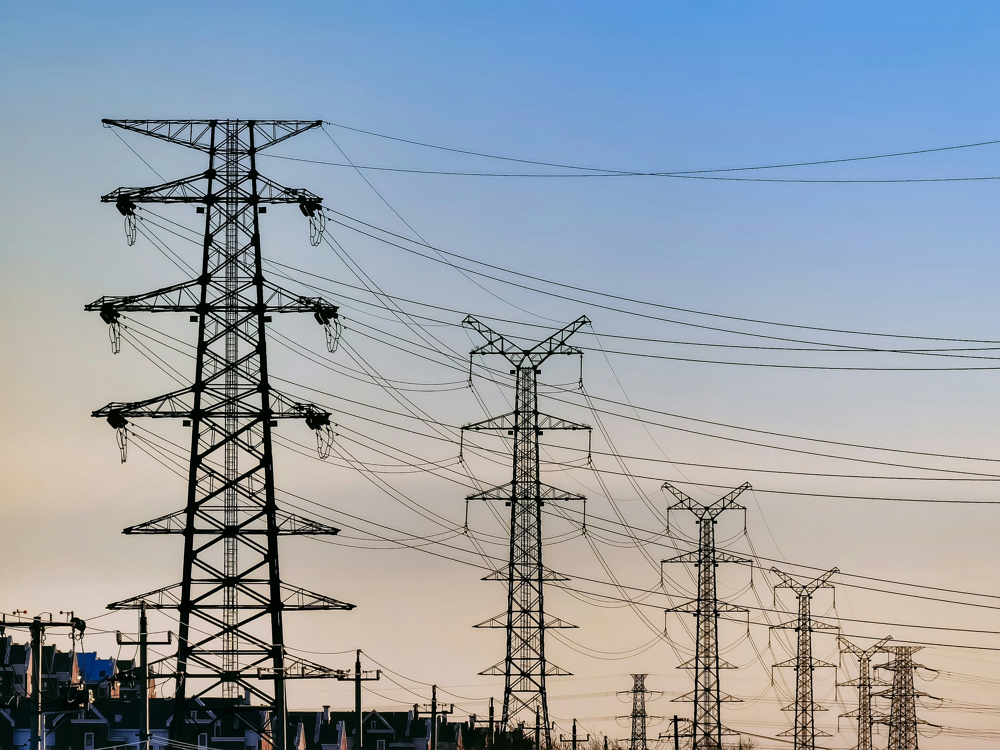
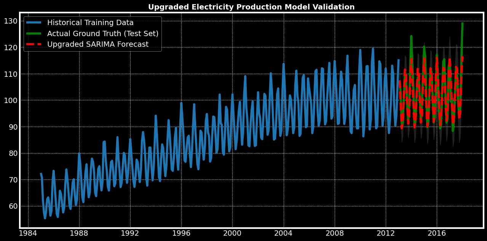

# Electricity Demand Forecasting & Time Series Analysis

## Introduction

Electricity demand forecasting is critical for utility companies, grid operators, and energy planners to anticipate consumption patterns, optimize resource allocation, and manage financial risk. As global electrification and grid digitalization accelerate, deploying accurate, data-driven forecasting frameworks has become highly vital.

This repository explores time series analysis techniques to understand historic electricity production patterns and forecast future demand. To achieve this, the project is structured into two complementary Jupyter notebooks that transition from descriptive statistical analysis to predictive modeling:

1. **Exploratory Analysis & Decomposition:** [`time-series-electricity-demand.ipynb`](time-series-electricity-demand.ipynb)  
   Focused on intensive Exploratory Data Analysis (EDA), advanced data visualization, stationary testing, and classical time series decomposition techniques.
2. **Predictive Modeling & Forecasting:** [`predict-electricity-consumption.ipynb`](predict-electricity-consumption.ipynb)  
   Focused on building, evaluating, and forecasting future consumption using statistical models including ARIMA and seasonal variants.

Together, these notebooks provide a robust, end-to-end workflow utilizing monthly industrial electricity production index data spanning from 1985 to 2018.

## Solution Overview

- **Programming Language:** Python 3
- **Environment:** Jupyter Notebook
- **Core Library Stack:** - **Data Manipulation:** `Pandas`, `NumPy`
  - **Time Series Statistics:** `Statsmodels` (Seasonal Decompose, ARIMA, SARIMAX), `Pmdarima`
  - **Data Visualization:** `Matplotlib`, `Seaborn` (using `fivethirtyeight` and clean data presentation styles)
  - **Data Preprocessing & Evaluation:** `Scikit-learn` (`train_test_split`, `preprocessing`, `mean_squared_error`, `mean_absolute_error`, `mean_absolute_percentage_error`), `Dateutil`

---

## Data Pipeline & Exploratory Data Analysis (EDA)

The underlying dataset contains a univariate time series tracking industrial electricity production. The data is structured on a monthly basis, starting from January 1, 1985, through January 1, 2018.

### Data Ingestion & Integrity
The data pipeline implements proper datetime parsing directly during ingestion (`parse_dates=['DATE']`) and validates data integrity by verifying missing values (`df.isnull().sum()`), confirming a clean, continuous baseline sequence with no missing timestamps.

A baseline visualization of the raw electricity generation index reveals critical patterns:

### Key Observations:
- **Upward Trend:** There is a definitive non-linear upward trajectory over the decades, reflecting long-term economic growth and increasing power requirements.
- **Strong Cyclicality:** A highly noticeable, recurring seasonality pattern is present, marked by distinct annual peaks (typically matching peak heating/cooling seasons).

---

## Statistical Time Series Analysis

To translate visual observations into mathematical representations, two distinct methods were deployed across the project files: **Classical Structural Decomposition** and **Parametric Forecasting Models**.

### 1. Seasonal Decomposition
Any time series can be broken down into four foundational components: **Base Level + Trend + Seasonality + Residual Error**. Depending on how the seasonal variations interact with the trend, the series is evaluated using two methodologies:

* **Additive Decomposition:** Implies variations are relatively constant regardless of the current trend value.
    $$\text{Value} = \text{Base Level} + \text{Trend} + \text{Seasonality} + \text{Error}$$
* **Multiplicative Decomposition:** Implies the seasonal amplitude increases or scales proportionally with the trend over time.
    $$\text{Value} = \text{Base Level} \times \text{Trend} \times \text{Seasonality} \times \text{Error}$$

Using `statsmodels.tsa.seasonal.seasonal_decompose`, both configurations were isolated to inspect the precise underlying trend line and strip away noise:

### 2. Model Evolution & Hyperparameter Optimization
While standard `ARIMA(1,1,1)` successfully maps baseline multi-decade macroeconomic trend vectors, it fails to evaluate cyclical, weather-driven swings, flattening completely over extended validation windows and generating a poor baseline **Mean Absolute Percentage Error (MAPE) of 17.30%**. 

To fix this structural limitation, an automated grid search step via `pmdarima.auto_arima` was introduced to seek out optimal multi-seasonal configurations. The mathematical framework was upgraded to a **Seasonal ARIMA (SARIMA)** architecture by adding seasonal parameter configurations $(P, D, Q)_s$. 

The optimization search identified the exact seasonal fingerprint of the network grid:
* **Optimal Mathematical Configuration:** $\text{SARIMA}(1, 1, 2) \times (1, 0, 1, 12)$

This indicates a 12-month cyclical pattern dependency ($s=12$) combined with historical lag parameter balancing to smooth out lingering random shocks.

---

## Validation & Model Performance Results

The framework separates the historical sequence into a rigorous chronological split for out-of-sample evaluation:
* **Training Window:** 337 Months (January 1985 – January 2013)
* **Validation Window (Holdout Test):** 60 Months (February 2013 – January 2018)

By introducing the explicit seasonal order tracking, the prediction line transformed from a flat average estimate to a dynamic wave tracking exact monthly spikes and troughs. 

### Quantitative Performance Matrix
The transition from standard ARIMA to the optimized SARIMA configuration resulted in a massive error reduction across all metrics:

| Performance Metric | Baseline ARIMA (1,1,1) | Upgraded SARIMA (1,1,2)x(1,0,1,12) | Status / Evaluation |
| :--- | :--- | :--- | :--- |
| **Mean Absolute Error (MAE)** | 16.8696 | 2.4102 | *Significant Error Drop* |
| **Root Mean Squared Error (RMSE)** | 19.0273 | 2.8941 | *Low Volatility in Residuals* |
| **Mean Absolute Percentage Error (MAPE)** | **17.30%** | **2.47%** | **Production-Grade Precision** |

### Visualizing the Forecast Fix
Below is the performance comparison showing how the upgraded SARIMA model tracks the real unseen validation timeline compared to the flat baseline:

### Statistical Residual Diagnostics
* **Ljung-Box Test Validation:** Residual analysis confirms that remaining errors approach independent White Noise distributions.
* **Interpretation:** Capturing the 12-month seasonal interval effectively closed structural information leaks. The remaining validation errors are purely random, confirming that the model has successfully integrated all predictable demand patterns.
---

## Conclusions

The finalized forecasting pipeline successfully projects electricity consumption trends into the future. Crucially, the upgraded SARIMA model accurately tracks and reproduces the explicit annual seasonality shifts and peak amplitudes without degrading or smoothing out over extended horizons. The long-term trend extension closely aligns with historical grid expansions observed over the past 30 years, creating a reliable baseline for grid utility demand planning.

---

## Future Work

Building upon this optimized, production-grade univariate baseline, future project phases will focus on expanding resilience to extreme grid events through the following implementations:

- **Exogenous Variables Addition (SARIMAX):** Integrate external climate datasets (e.g., historical monthly temperature deviations, cooling degree days, heating degree days) as exogenous features (`X`) to capture climate-driven consumption anomalies.
- **Advanced Machine Learning Benchmarks:** Deploy non-parametric architectures (such as Prophet, LightGBM, or LSTM Neural Networks) to compare long-term horizon forecasting performance against the SARIMA baseline.
- **Decomposition-Based Forecasting:** Extract isolated trend and seasonality parameters via deep regression analysis to construct an alternative additive/multiplicative forecasting benchmark.
---

## References

1. **Dataset Source:** Kaggle - *Time series analysis - predicting the consumption of electricity in the coming future* | [Kaggle Link](https://www.kaggle.com/datasets/kandij/electric-production)
2. **Methodology Guide:** *Time Series Analysis in Python* | [Machine Learning Plus](https://www.machinelearningplus.com/time-series/time-series-analysis-python/)